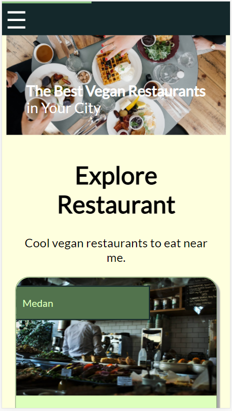
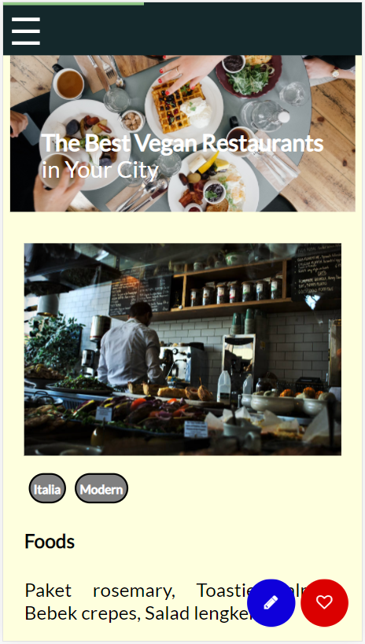

# Restaurant Apps (Dicoding Submission)
Simple catalog app made from scratch.

## Features

* Main Page (Restaurant List)
* Restaurant Detail
* Favorite Restaurants
* Native Capability




## Quick Start

Clone project and install dependencies:
```bash
$ git clone https://github.com/dyhaz/katalog-restoran.git
$ cd katalog-restoran
$ npm install
```

Start the server:
```bash
$ npm run start-dev
```
